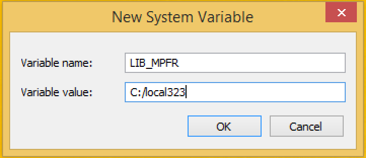
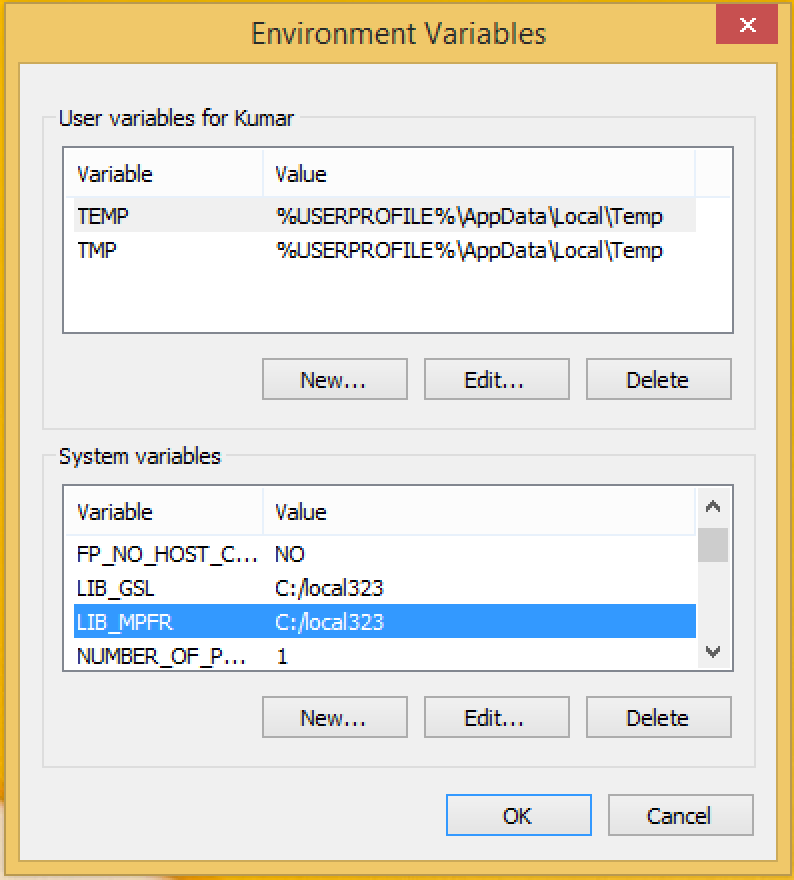

scModels is an R package accompanying the paper "Probability distributions for single cell mRNA counts" by Lisa Amrhein, Kumar Harsha and Christiane Fuchs
for distribution fitting of discrete count distributions. Included are the Poisson, the negative binomial and most importantly a new immplementation of the Poisson-beta distribution (density, distribution and quantile function and random number generation) together with a needed new implementation of Kummer's function (also: confluent hypergeometric function of the first kind). Three implemented Gillespie algorithms allow synthetic data simulation via the basic, switching and bursting mRNA generating process, respectively. Finally likelihood functions for one population and two population mixtures - with and without zero-inflations - allow distribution fittings of the Poisson, negative binomial and the Poisson-beta distribution. The package depends on the MPFR/GMP libraries which need to be installed separately (see description below).


Installing MPFR
--------------

#### On Linux
On Ubuntu, the mpfr libraries can be installed with the following command:

```bash
sudo apt-get install -qy libmpfr-dev
```

For RPM based distributions, the corresponding package may be found at [RPMfind](https://fr2.rpmfind.net/linux/rpm2html/search.php?query=mpfr-devel).

#### On OS X
MPFR libraries can be installed on OS X with the [Homebrew](https://brew.sh/) package manager.

```bash
brew install mpfr
```

Installing Homebrew is easy. The following command does it.

```bash
/usr/bin/ruby -e "$(curl -fsSL https://raw.githubusercontent.com/Homebrew/install/master/install)"
```

#### On Windows
Installation on Windows requires building MPFR with the recommended toolchain for R.

Pre-compiled libraries have been put together by Prof. Brian Ripley and are available on his [webpage](http://www.stats.ox.ac.uk/pub/Rtools/). The files are under [goodies/multilib](http://www.stats.ox.ac.uk/pub/Rtools/goodies/multilib/) directory. This includes a 'local' tree, named as [local323.zip](http://www.stats.ox.ac.uk/pub/Rtools/goodies/multilib/local323.zip) at the time this manual was prepared, that contains the headers and static libraries for MPFR amongst others.

The following instructions are vaild for Windows 8 and above.

1. The local323.zip has to be extracted at a convenient place. The C: drive is the location for the screenshots used in this manual.
2. The location of the library needs to be added to the environment variables of the system. There are two ways to get to the list of environment variables:

    * One of the ways is to select Computer -> System properties in the Explorer. In the next window, select Advanced system settings.
    
    
    
    * Another option is to use the Windows search bar as shown in the picture below:  
    
3. The location needs to be added against the variable LIB_MPFR.  
    
    
    
    
4. Rstudio (or the current R session) has to be restarted so that these environment variables can be read.


Running the package test-suite
---------------

The package comes with a comprehensive test suite. In order to run the tests, the tarball must be extracted. Once that is done, the following command will run all tests:

```r
devtools::test("/path/to/scModels/")
```
