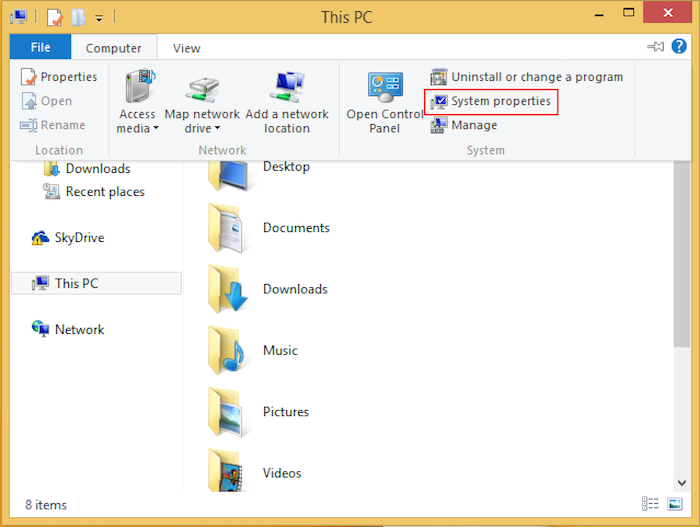
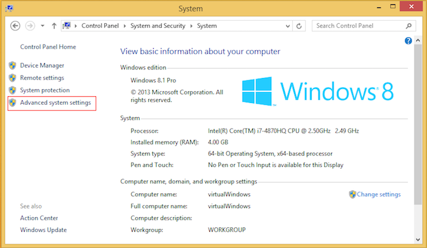
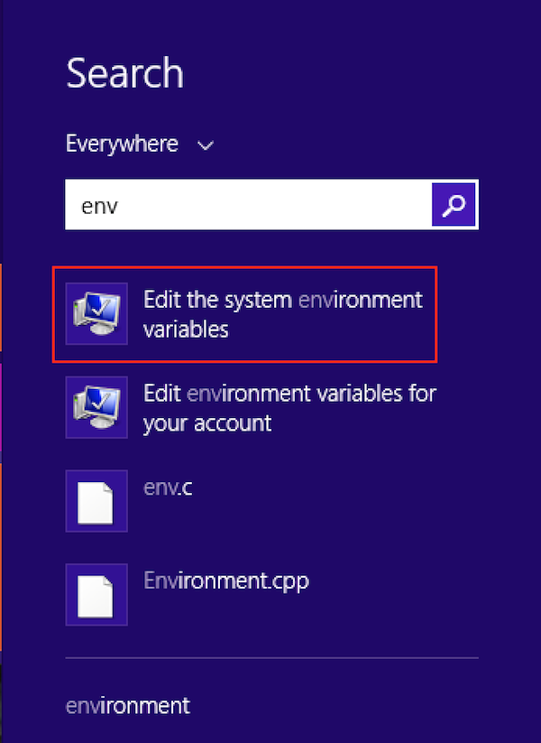
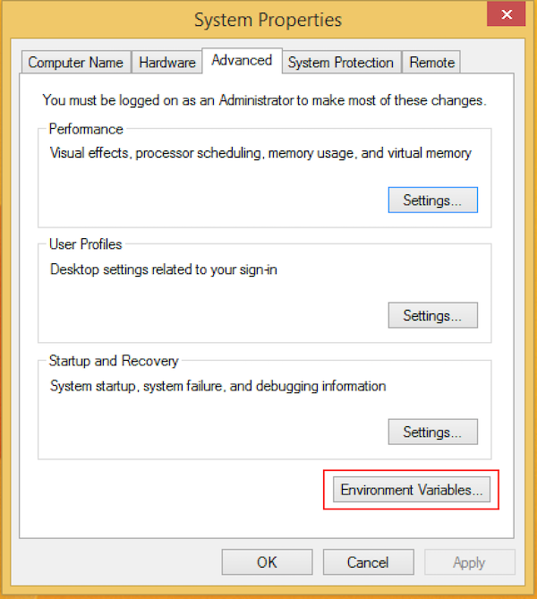
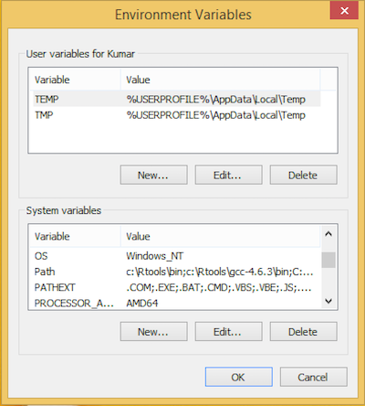
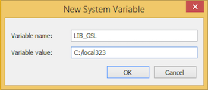
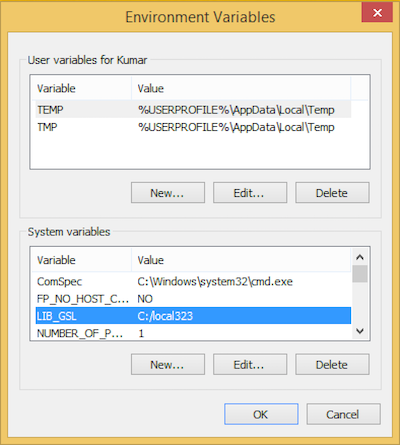

## About GSL

The GNU Scientific Library (GSL) ([https://www.gnu.org/software/gsl/](https://www.gnu.org/software/gsl/)) is a numerical library for C and C++ programmers. It is free software under the GNU General Public License.

The library provides a wide range of mathematical routines such as random number generators, special functions and least-squares fitting. There are over 1000 functions in total with an extensive test suite. The implementation of the confluent hypergeometric function of the first kind (gsl_sf_hyperg_1F1) is used in this package.

## About RcppGSL

The RcppGSL ([http://dirk.eddelbuettel.com/code/rcpp.gsl.html](http://dirk.eddelbuettel.com/code/rcpp.gsl.html)) package provides an easy-to-use interface between GSL data structures and GNU R using concepts from Rcpp which is itself a package that eases the interfaces between R and C++. This package also serves as a prime example of how to build a package that uses 'Rcpp' to connect to another third-party library.

## Why GSL ?

The mixed-poisson-beta distribution uses the solution to the confluent hypergeometric function to compute values for various quantiles. The choice of GSL for this purpose was an apt fit because of the following reasons:

* It is distributed under the GNU General Public License.
* Optimised C/C++ implementations are available for alot of mathematical routines.
* The library is thread-safe.
* No further dependencies on packages.
* Existing interface to Rcpp.

## Installation
### Installation on Linux variants

On Ubuntu, the **libgsl** packages are available. The following command will get it up and running:

> sudo apt install libgsl2 libgsl-dev gsl-bin

Similarly named packages can be found for other distributions as well.

### Installation on Mac

GSL can be installed on a Mac with Homebrew ([https://brew.sh/](https://brew.sh/)).
Installing Homebrew is easy. The following needs to typed at a terminal:

> /usr/bin/ruby -e "$(curl -fsSL https://raw.githubusercontent.com/Homebrew/install/master/install)"

Once Homebrew is installed, the following command needs to be run:

> brew install gsl

Without a package manager, the library will have to be compiled from source that can be unfairly tedious.

### Installation on Windows

Installation on Windows requires building GSL with the recommended toolchain for R.

Pre-compiled libraries have been put together by Prof. Brian Ripley and are available on his webpage ([http://www.stats.ox.ac.uk/pub/Rtools/](http://www.stats.ox.ac.uk/pub/Rtools/)). The files are under goodies/multilib ([http://www.stats.ox.ac.uk/pub/Rtools/goodies/multilib/](http://www.stats.ox.ac.uk/pub/Rtools/goodies/multilib/)) directory. This includes a 'local' tree, named as local323.zip ([http://www.stats.ox.ac.uk/pub/Rtools/goodies/multilib/local323.zip](http://www.stats.ox.ac.uk/pub/Rtools/goodies/multilib/local323.zip)) at the time this manual was prepared, that contains the headers and static libraries for GSL.

The following instructions are vaild for Windows 8 and above.

1. The local323.zip has to be extracted at a convenient place. The C: drive is the location for the screenshots used in this manual.
2. The location of the library needs to be added to the environment variables of the system. There are two ways to get to the list of environment variables:

    * One of the ways is to select Computer -> System properties in the Explorer.  
      
    In the next window, select Advanced system settings.  
    
    
    * Another option is to use the Windows search bar as shown in the picture below:  
    
3. The location needs to be added against the variable LIB_GSL.  
      
      
      
      
4. Rstudio (or the current R session) has to be restarted so that these environment variables can be read.
5. The RcppGSL package has to be installed to complete the configuration of GSL development libraries with R. It is worth noting that installing the mpb2 package will take care of this step anyway.

## Verifying GSL installation

To verify proper installation of GSL, the following commands can be run at an R command prompt:
```{r eval=FALSE}
RcppGSL::CFlags()
RcppGSL::LdFlags()
```

On UNIX-type operating systems (OS X and Linux), the following command on the terminal should display the version of GSL installed:

> gsl-config --version

## Running tests for the package

The package comes with a comprehensive test suite. In order to run the tests, the tarball must be extracted. Once that is done, the following command will run all tests:

```{r eval=FALSE}
devtools::test("/path/to/mpb2/")
```
